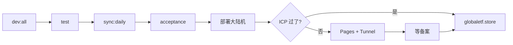

# 开发与运维 Playbook

复盘 globaletf 从本地 vibe coding 到公网可用的完整路径：**踩坑点、流程卡点、可复用 skill 与脚本模板**。

**相关文档：** [STATUS.md](./STATUS.md)（现状）· [DATA-SYNC.md](./DATA-SYNC.md)（同步）· [DEPLOY-ALIYUN.md](./DEPLOY-ALIYUN.md) · [DEPLOY-PAGES.md](./DEPLOY-PAGES.md)

---

## 一、标准开发流程

```
本地 dev:all → 改代码 + npm test → sync:daily → acceptance → build → 部署大陆机 → 对外验证
```

| 步骤 | 命令 / 动作 | 通过标准 |
|------|-------------|----------|
| 1. 本地联调 | `npm run dev:all` | 前端 :5173、API :8787 均有数据 |
| 2. 单测 | `npm test` | 全绿（约 280+ 项） |
| 3. 灌库 | `npm run sync:daily` | 日志无致命错误，10–20 分钟 |
| 4. 数据门禁 | `npm run acceptance` | NASDAQ 覆盖、冲突数等全绿 |
| 5. 构建 | `npm run build` | `dist/` 生成 |
| 6. 部署 API | 见 [DEPLOY-ALIYUN.md](./DEPLOY-ALIYUN.md) | `curl http://127.0.0.1/api/health` → `{"ok":true}` |
| 7. 对外 | Pages 自动构建 或 wrangler deploy | `https://globaletf.pages.dev/api/health` OK |

**数据时效（排查「页面不对」时先分清）：**

| 数据 | 更新方式 | 频率 |
|------|----------|------|
| 场内折溢价 | live API（页面轮询） | 打开页面时 ~90s |
| 场外限购/费率 | `sync:daily` / `sync:limits` | 工作日 cron |
| 季报持仓 | `sync:holdings` | 季报披露后 |

---

## 二、流程卡点总图



**最容易断链的三处：**

1. **cron 没真正跑**（裸 `npm run`）→ 数据旧、用户以为坏了  
2. **ICP 未过却用根域名** → 403 Non-compliance  
3. **只部署代码不 sync / 不拷库** → 页面空或表现和本地不一致  

---

## 三、踩坑清单（按阶段）

### 本地开发

| 坑 | 现象 | 处理 |
|----|------|------|
| 只起 Vite | 有壳无数据 | 用 `npm run dev:all` |
| 多开 dev 进程 | 端口占用 | 起新前杀旧进程 |
| 本地库过旧 | 和线上不一致 | `sync:daily` 或从生产拷 `etflimit.sqlite` |

### 数据同步

| 坑 | 现象 | 处理 |
|----|------|------|
| cron 写 `npm run sync:daily` | 日志空、任务未执行 | 必须用 `scripts/daily-sync.sh`，显式 `PATH` |
| 上线当天下午才配 cron | 当天早上必然错过 | 上线当天手动 `./scripts/daily-sync.sh` |
| `fund\|fallback` | 基金表用旧缓存 | 查 `sync_status`，必要时全量 sync |
| 份额类别混桶 | 016532 类误报「待核实」 | `purchaseLimitReconciliation` 按 shareClass + 渠道过滤 |
| 主题 QDII 进指数列表 | 016202 进 NASDAQ | `isExcludedIndexDiscoveryName` + F10 跟踪标的 gate |
| 代销 vs 直销不一致 | E/F/D 进冲突区 | 产品预期：两渠道可不同，按渠道展示 |

### 部署（阿里云 + 宝塔）

| 坑 | 现象 | 处理 |
|----|------|------|
| Docker 拉镜像超时 | 部署卡住 | 大陆机用 **systemd 裸机** |
| 宝塔未装 Nginx | `nginx: command not found` | 应用直连 `PORT=80`，备案后再反代 |
| 监听 8787 vs 80 | 外网 8787 不通 | 安全组放行 80/443；生产 `PORT=80` |
| SSH 中断导致 build 一半 | 服务半残 | `nohup` + `scripts/baota-systemd-deploy.sh` |
| 只传代码不传库 | 页面空 | 部署后 `sync:daily` 或 SCP sqlite |

### 域名与备案

| 坑 | 现象 | 处理 |
|----|------|------|
| DNS → 大陆 IP 未备案 | 403 ICP | 备案前主入口用 **Pages** |
| 根域名当主站分享 | 用户打不开 | `globaletf.pages.dev` |
| DNS 切 Cloudflare | IP 直连失效 | 预期行为；API 走 Tunnel |

### Cloudflare Tunnel

| 坑 | 现象 | 处理 |
|----|------|------|
| cloudflared 偶发断线 | 日志 timeout | `systemd enabled` 自动重连 |
| Pages `/api` 偶发慢 | HTTP/2 framing error | 用 HTTP/1.1 测；查 Tunnel + 大陆机 health |
| `API_ORIGIN` 配错 | 前端 API 404 | `wrangler.toml` → `https://api.globaletf.store` |

### Cursor / 本机环境

| 坑 | 现象 | 处理 |
|----|------|------|
| Agent「Taking longer than expected」 | 工具卡住 | 网络/SSH 超时、VPN、进程过多 |
| 代理 DNS（198.18.x） | curl 大陆机慢 | 测生产时关代理或分流 |
| 密码出现在聊天记录 | 安全风险 | 轮换密码，长期 SSH 公钥 |

---

## 四、上线 / 运维 Checklist

### 上线前

- [ ] `npm test` + `npm run acceptance` 全绿  
- [ ] crontab 使用 `daily-sync.sh` / `limits-sync.sh`（见 [DATA-SYNC.md](./DATA-SYNC.md)）  
- [ ] 安全组 80、443 放行  
- [ ] 本机 `curl -s http://127.0.0.1/api/health`  
- [ ] 对外入口明确：备案前 Pages，备案后正式域名  

### 每周（或出问题时）

```sh
tail -20 /opt/globaletf/logs/daily-sync.log
systemctl is-active globaletf cloudflared
curl -s http://47.100.5.7/api/health
npm run health-check   # 本地或服务器均可
```

### 备案通过后

- [ ] 宝塔申请 HTTPS（`scripts/aliyun-enable-https.sh`）  
- [ ] 根域名 `globaletf.store` 验证  
- [ ] 决定是否仍用 Pages 作主站或切回大陆直连  

---

## 五、可复用的 Cursor Skills

在 Cursor 里做同类项目（**数据抓取 + SQLite + 大陆 API 机 + CF Pages/Tunnel**）时，可直接挂载这些 skill：

| Skill | 路径 / 触发场景 | 在本项目的用途 |
|-------|-----------------|----------------|
| **wrangler** | `~/.codex/skills/wrangler` | Pages 构建、`wrangler.toml`、`API_ORIGIN`、本地 preview |
| **cloudflare** | `~/.codex/skills/cloudflare` | Pages、Tunnel、DNS、Zero Trust 总览 |
| **workers-best-practices** | `~/.codex/skills/workers-best-practices` | Pages Function 代理 API、避免 streaming/超时反模式 |
| **babysit** | `~/.cursor/skills-cursor/babysit` | PR 评论、冲突、**CI 红了循环修到绿** |
| **ci-investigator** | Cursor subagent | 单次失败 check 的根因摘要 |
| **loop** | `~/.cursor/skills-cursor/loop` | 定时跑 `health-check` / `acceptance`（如 `/loop 1d`） |
| **create-rule** | `~/.cursor/skills-cursor/create-rule` | 把「cron 必须用 wrapper」「部署前先 acceptance」写成 `.cursor/rules` |
| **split-to-prs** | `~/.cursor/skills-cursor/split-to-prs` | 大 diff（discovery + limits + deploy）拆成可 review 的 PR |
| **create-skill** | `~/.cursor/skills-cursor/create-skill` | 把本 playbook 沉淀成项目专属 skill（如 `globaletf-deploy`） |

**暂未用到、但同类项目可能需要的：**

| Skill | 何时用 |
|-------|--------|
| **web-perf** | 指数页 LCP/轮询性能审计 |
| **frontend-design** / **ui-ux-pro-max** | 改版 UI 时 |
| **sdk** | 用 Cursor SDK 自动化 nightly sync / 部署 |

**给 Agent 的推荐话术（可复制到 rule）：**

- 「部署前先 `npm run acceptance`」  
- 「改 cron 必须用 `scripts/*.sh`，禁止裸 `npm run`」  
- 「查生产问题顺序：DNS → ICP/安全组 → systemd → sync 日志」  
- 「Cloudflare 相关先读 wrangler skill」  

---

## 六、可复用的仓库内流程与脚本

这些是**已验证的模板**，新项目可整段拷贝再改路径/服务名。

### 6.1 开发与质量门禁

| 资产 | 路径 | 复用方式 |
|------|------|----------|
| 前后端一体本地启动 | `scripts/dev-all.sh` | 任意 Vite + Express 项目 |
| 数据 CLI | `src/sync/cli.ts` | `daily` / `quotes` / `limits` 子命令模式 |
| Acceptance 门禁 | `src/acceptance/` | 快照完整性、业务不变量（覆盖数、冲突数） |
| Vitest 单测 | `src/**/*.test.ts` | provider 层 mock fetch，domain 层纯函数 |

### 6.2 定时任务（核心模式）

**模式：** shell wrapper 设置 `PATH` + `cd` 到仓库 + 写日志 + 非零退出码告警。

| 脚本 | 用途 |
|------|------|
| `scripts/daily-sync.sh` | 全量 sync + acceptance |
| `scripts/limits-sync.sh` | 午间/午后限购增量 |
| `scripts/check-sync-health.sh` | cron 健康探测（`npm run health-check`） |
| `scripts/com.etflimit.*.plist.example` | macOS LaunchAgent 模板 |

生产 crontab 示例见 [DATA-SYNC.md](./DATA-SYNC.md#linux-cron生产推荐-wrapper)。

### 6.3 部署

| 脚本 | 用途 |
|------|------|
| `scripts/baota-systemd-deploy.sh` | 宝塔新机一键：依赖、build、systemd |
| `scripts/aliyun-systemd-deploy.sh` | 通用阿里云 systemd 部署 |
| `scripts/aliyun-cloudflared-install.sh` | Tunnel connector 安装 |
| `scripts/aliyun-enable-https.sh` | 备案后 HTTPS |
| `deploy/globaletf.service` | systemd unit 模板（注意生产 `PORT`） |

**部署包模式：** 本地 `tar` 排除 `node_modules` / `.git` → `scp` → 服务器 `npm ci && npm run build && systemctl restart`。

### 6.4 数据域模式（代码层）

| 模式 | 位置 | 说明 |
|------|------|------|
| Provider 链 | `src/providers/providerChain.ts` | 多源 fallback，易单测 |
| 限购对账 | `src/domain/purchaseLimitReconciliation.ts` | 渠道 + 份额类别维度，避免误报 |
| 基金发现 + 门禁 | `src/domain/fundDiscovery.ts`、`src/sync/trackingProfileSync.ts` | 名称排除 + F10 校验后再 `enabled` |
| 审计 CLI | `src/audit/` | 跟踪指数人工/半自动核对 |
| 探测脚本 | `scripts/probe-announcements.ts` | 新数据源上线前探路 |

### 6.5 公网架构模板

```
浏览器 → Cloudflare Pages（静态 + /api Function）
              ↓
         api.example.com（Tunnel）
              ↓
         大陆 VPS :80（Express + SQLite）
              ↓
         cron daily-sync.sh
```

适用：**需要抓大陆数据源、又要在备案前对外 HTTPS** 的只读数据产品。

---

## 七、排错顺序（通用）

1. **用户访问层**：DNS 解析到哪？ICP？Pages 还是 IP？  
2. **边缘层**：`curl https://globaletf.pages.dev/api/health`、`curl https://api.globaletf.store/api/health`  
3. **应用层**：`systemctl status globaletf`、`curl http://127.0.0.1/api/health`（在服务器上）  
4. **数据层**：`sync_status` 表、`logs/daily-sync.log`、库文件 mtime  
5. **业务层**：`npm run acceptance`、指数页「待核实」是否真冲突  

---

## 八、经验三条

1. **数据管道优先于 UI** — 先 `acceptance` 再堆功能；silent fail 最常见在 cron 和 provider。  
2. **外部依赖单独验证** — 东财、备案、Tunnel 各测一遍，不要假设「部署了就能访问」。  
3. **文档单一事实源** — 现状看 [STATUS.md](./STATUS.md)，流程看本文，细节看各 DEPLOY/DATA-SYNC。  

---

## 九、建议的 Cursor 项目 Rule（可选）

若希望 Agent 默认遵守本 playbook，可在项目 `.cursor/rules` 增加：

```markdown
- 本地开发用 npm run dev:all，不单开 vite
- 部署或改 cron 前阅读 docs/PLAYBOOK.md 与 docs/DATA-SYNC.md
- 生产 cron 只用 scripts/daily-sync.sh 与 limits-sync.sh
- 改限购/发现逻辑后必须 npm test 且 npm run acceptance
- Cloudflare / Tunnel / wrangler 改动先参考 wrangler skill
- 不在日志或聊天中输出 cloudflared token、服务器密码
```

需要时可让 Agent 用 **create-rule** skill 自动生成正式 rule 文件。
